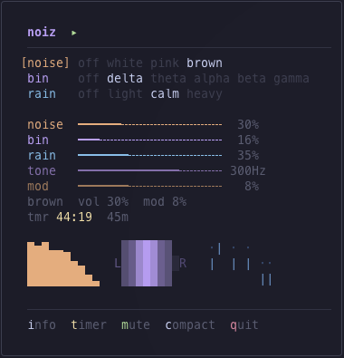

# noiz


Terminal noise generator for focus and concentration.

Real-time stereo noise synthesis with binaural brainwave presets, rain overlay, and a minimal TUI. Noise and binaural tones are generated in real-time, while rain uses looping wav samples.



## Install

Requires [Rust](https://www.rust-lang.org/tools/install) (stable).

```bash
# Install Rust (if you don't have it)
curl --proto '=https' --tlsv1.2 -sSf https://sh.rustup.rs | sh

# Install noiz
git clone https://github.com/Gaurgle/noiz.git
cd noiz
cargo install --path .
```

## Usage

```bash
noiz                    # brown noise (default, 30% vol)
noiz white              # white noise
noiz pink               # pink noise
noiz brown 45m          # timer, fade out after 45 minutes
noiz brown 1h           # any duration: 30s, 15m, 2h, etc.
noiz pink -v 0.5        # set noise volume (0.0-1.0)
```

Press `t` in the TUI to cycle preset timers (15m, 45m, 1h), or pass any duration via CLI.

Everything else is controlled from the TUI: binaural presets, rain overlay, and all volumes.

## TUI Controls

Navigate with `hjkl` (vim) or arrow keys. Selected parameters are shown with `[brackets]`. Press `i` for an in-app info overlay.

### Sources

Source labels highlight the first letter as a keybind hint. The rest lights up in color when active.

| Row | Options | Keys |
|-----|---------|------|
| **noise** | off, white, pink, brown | `n` cycle, `N` toggle on/off |
| **bin** | off, delta, theta, alpha, beta, gamma | `b` cycle, `B` toggle on/off |
| **rain** | off, light, calm, heavy | `r` cycle, `R` toggle on/off |

Shift toggles remember your last active setting per source.

### Controls

| Row | Range | What it does |
|-----|-------|-------------|
| **noise** vol | 0-100% | Noise volume |
| **bin** vol | 0-100% | Binaural tone volume |
| **rain** vol | 0-100% | Rain sample volume |
| **tone** | 40-400 Hz | Binaural carrier frequency |
| **mod** | 0-20% | Stereo LFO modulation depth |

### Other keys

| Key | Action |
|-----|--------|
| `t` | Timer presets: 15m → 45m → 1h → off. Fades out + morse "end" signal |
| `h`/`l` or `←`/`→` on the timer row | ±1 minute (select the `tmr` row to tweak) |
| `Shift`+`h`/`l` or `Shift`+`←`/`→` on the timer row | ±1 second |
| `m` | Mute/unmute (0.4s fade) |
| `p` | Pause: mute and freeze the timer countdown. Press again to resume |
| `c` | Compact mode (no border, no animations, short bars, active source only) |
| `i` | Info overlay |
| `q` / `Esc` / `Ctrl+C` | Quit (750ms fade out) |

## Noise Types

| Type | Description |
|------|-------------|
| **white** | Equal energy across all frequencies, gain-balanced for perceived loudness |
| **pink** | Energy drops 3 dB/octave (natural, balanced) |
| **brown** | Energy drops 6 dB/octave (deep, dark, lowpass-filtered for warmth) |

Each noise generator runs independently with its own volume envelope. Transitions between types are seamless with 1.5s crossfade.

## Binaural Presets

Binaural beats are created by playing two discrete sine tones (one per ear) with a slight frequency difference. The brain perceives this difference as a rhythmic pulse. **Requires headphones.**

Presets are completely independent from noise, so you can combine any noise type with any binaural preset.

| Preset | Brainwave | Split | Default carrier | Effect |
|--------|-----------|-------|-----------------|--------|
| **delta** | 1-4 Hz | 2 Hz | 200 Hz | Deep sleep, healing |
| **theta** | 4-8 Hz | 6 Hz | 250 Hz | Meditation, creativity |
| **alpha** | 8-14 Hz | 10 Hz | 300 Hz | Relaxed focus, flow |
| **beta** | 14-30 Hz | 18 Hz | 350 Hz | Active focus, energy |
| **gamma** | 30+ Hz | 40 Hz | 400 Hz | Deep concentration |

Carrier frequency is adjustable (40-400 Hz) via the **tone** control.

## Rain Overlay (experimental)

> Rain is a work in progress; sample quality is being improved. It only works when running noiz from the cloned repo directory.

Rain samples are layered on top of any noise/binaural combination. Press `r` to cycle through:

| Rain | Description |
|------|-------------|
| **light** | Gentle patter |
| **calm** | Steady rain |
| **heavy** | Downpour |

Samples are loaded from `samples-rain/` relative to the binary or current directory. Transitions crossfade with 500ms fade envelopes.

## Features

- **Three independent layers**: noise, binaural, and rain with separate volume controls
- **Seamless transitions**: each noise generator has its own 1.5s volume envelope
- **Fade in/out**: 750ms on start/quit, 0.4s on pause, 5s on timer expiry
- **Stereo modulation**: adjustable slow LFO with different phase per channel
- **Binaural beats**: pure discrete L/R sine tones, no channel bleed
- **Rain overlay**: preloaded wav samples with crossfade looping
- **Visualizer**: spectrum bars for noise, L/R sweep for binaural, rain drops by intensity
- **Timer**: preset 15m/45m/1h via `t` in the TUI, or any duration via CLI (`30s`, `2h`, etc.). Fades out, plays a morse "end" signal, stays open

## Stack

Rust, [cpal](https://github.com/RustAudio/cpal), [ratatui](https://github.com/ratatui/ratatui), [crossterm](https://github.com/crossterm-rs/crossterm), [hound](https://github.com/ruuda/hound)

## See Also

- [repoz](https://github.com/Gaurgle/repos-cli): terminal dashboard for managing multiple git repos
- [notez](https://github.com/Gaurgle/notez-cli): fast terminal note-taking with fuzzy search
